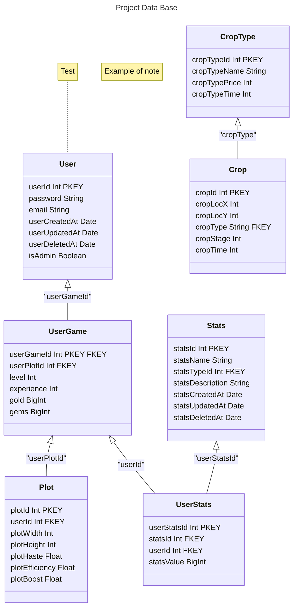

# ig3_projet_web_back

```mermaid
---
title: Project Data Base
---
classDiagram
    note "Example of note"
    note for User "Test"
    
    User <|-- UserGame: "userGameId"
    Stats <|-- UserStats: "userStatsId"
    UserGame <|-- Plot: "userPlotId"
    CropType <|-- Crop: "cropType"
    UserGame <|-- UserStats: "userId"

    class User{
        userId Int PKEY
        password String
        email String
        userCreatedAt Date
        userUpdatedAt Date
        userDeletedAt Date
        isAdmin Boolean
    }
    class UserGame {
        userGameId Int PKEY FKEY
        userPlotId Int FKEY
        level Int
        experience Int
        gold BigInt
        gems BigInt
    }
    class UserStats {
        userStatsId Int PKEY
        statsId Int FKEY
        userId Int FKEY
        statsValue BigInt
    }
    class Stats {
        statsId Int PKEY
        statsName String
        statsTypeId Int FKEY
        statsDescription String
        statsCreatedAt Date
        statsUpdatedAt Date
        statsDeletedAt Date
    }
    class Plot {
        plotId Int PKEY
        userId Int FKEY
        plotWidth Int
        plotHeight Int
        plotHaste Float
        plotEfficiency Float
        plotBoost Float
    }
    class Crop {
        cropId Int PKEY
        cropLocX Int
        cropLocY Int
        cropType String FKEY
        cropStage Int
        cropTime Int
    }
    class CropType {
        cropTypeId Int PKEY
        cropTypeName String
        cropTypePrice Int
        cropTypeTime Int
    }

```